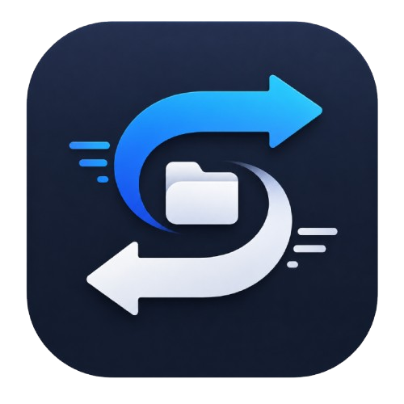

# Shuttle

<p align="center">
  
</p>

A file manager for Mac that sends files to connected devices — SSH servers, Raspberry Pis, Android phones, tablets, and VR headsets — through a clean drag-and-drop interface.

Built with Python, PySide6, and Paramiko.

## Features

- 🖥 **Remote file explorer** — Browse any SSH server or Android device
- 📂 **Drag-and-drop upload** — Drop files from Finder into the explorer
- 📱 **Android USB support** — Connect phones/tablets via ADB (no MTP needed)
- 📊 **Transfer queue** — Queue multiple uploads with speed, ETA, and progress
- 🔍 **Recursive search** — Search across subdirectories with Enter
- 🔄 **Multi-server** — Save multiple devices, set a default for auto-connect
- ✏️ **Inline rename** — Slow-click to rename files directly
- 💾 **Disk space bar** — See how full the remote drive is
- 🗑 **Auto-cleanup** — Move local files to trash after upload
- ⌨️ **Keyboard shortcuts** — ⌘+R, ⌘+N, ⌘+F, ⌘+Delete, etc.

## Quick Start

```bash
pip install -r requirements.txt
python main.py
```

## Requirements

- Python 3.11+
- SSH key-based access to your server
- For Android: `brew install android-platform-tools` + USB Debugging enabled

## Configuration

Stored at `~/.Shuttle/config.json`:

```json
{
  "servers": {
    "my-server": {
      "name": "My Server",
      "connection_type": "ssh",
      "username": "user",
      "host": "192.168.1.100",
      "ssh_key_path": "~/.ssh/id_rsa",
      "ssh_port": 22,
      "remote_base_dir": "/mnt/external"
    },
    "my-phone": {
      "name": "My Phone",
      "connection_type": "adb",
      "device_id": "DEVICE_SERIAL",
      "remote_base_dir": "/sdcard"
    }
  },
  "default_server_id": "my-server",
  "delete_after_transfer": true,
  "file_extensions": [".mp4", ".mkv", ".avi", ".srt"],
  "skip_patterns": [".DS_Store", "._*"]
}
```

## Keyboard Shortcuts

| Shortcut   | Action                            |
| ---------- | --------------------------------- |
| `⌘+F`      | Focus search bar                  |
| `Enter`    | Navigate into folder / run search |
| `⌘+↑`      | Go back one directory             |
| `⌘+N`      | New folder                        |
| `⌘+R`      | Refresh                           |
| `⌘+Delete` | Delete selected                   |
| `Escape`   | Clear search / deselect           |

## Development

```bash
# Install dev dependencies
make dev-install

# Run the app
make run

# Format code
make format

# Lint
make lint

# Run tests
make test

# Build distribution
make build
```

## Docs

- [Architecture](docs/ARCHITECTURE.md)
- [Feature Ideas](docs/ideas.md)
