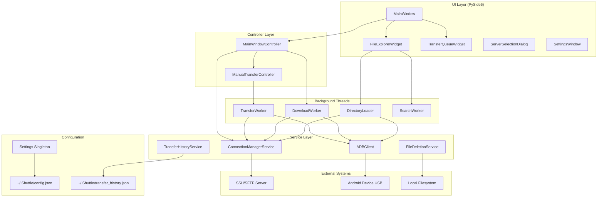
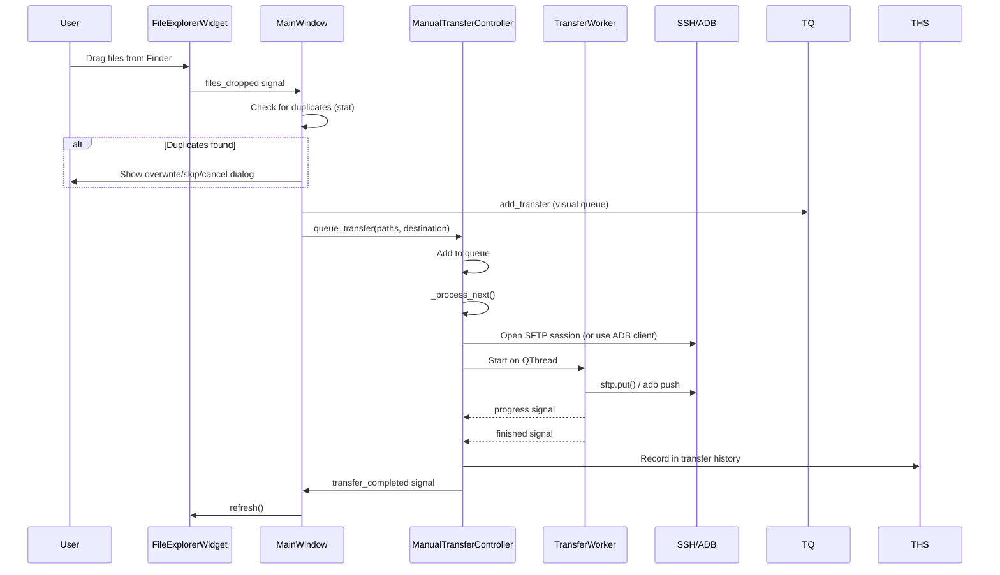
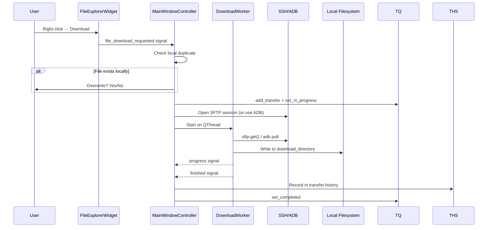
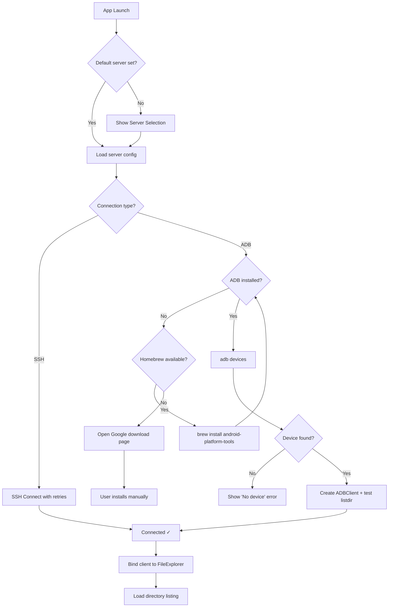
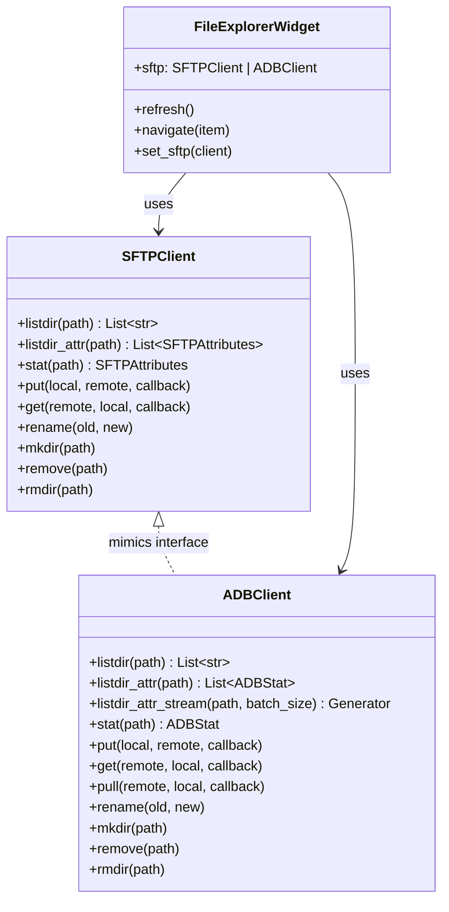

# System Diagram

## High-Level Architecture

```mermaid
graph TB
    subgraph UI["UI Layer (PySide6)"]
        MW[MainWindow]
        FE[FileExplorerWidget]
        TQ[TransferQueueWidget]
        SD[ServerSelectionDialog]
        SW[SettingsWindow]
    end

    subgraph Controllers["Controller Layer"]
        MWC[MainWindowController]
        MTC[ManualTransferController]
    end

    subgraph Workers["Background Threads"]
        TW[TransferWorker]
        DW[DownloadWorker]
        DL[DirectoryLoader]
        SR[SearchWorker]
    end

    subgraph Services["Service Layer"]
        CM[ConnectionManagerService]
        ADB[ADBClient]
        FDS[FileDeletionService]
        THS[TransferHistoryService]
    end

    subgraph External["External Systems"]
        SSH[SSH/SFTP Server]
        Android[Android Device USB]
        FS[Local Filesystem]
    end

    subgraph Config["Configuration"]
        Settings[Settings Singleton]
        JSON["~/.Shuttle/config.json"]
        History["~/.Shuttle/transfer_history.json"]
    end

    MW --> MWC
    MW --> FE
    MW --> TQ
    MWC --> MTC
    MWC --> CM
    MWC --> DW
    MTC --> TW
    FE --> DL
    FE --> SR

    CM --> SSH
    ADB --> Android
    FDS --> FS
    THS --> History
    Settings --> JSON

    TW --> CM
    TW --> ADB
    DW --> CM
    DW --> ADB
    DL --> CM
    DL --> ADB
```

## Upload Flow

```mermaid
sequenceDiagram
    participant User
    participant Explorer as FileExplorerWidget
    participant MW as MainWindow
    participant MTC as ManualTransferController
    participant TW as TransferWorker
    participant Remote as SSH/ADB

    User->>Explorer: Drag files from Finder
    Explorer->>MW: files_dropped signal
    MW->>MW: Check for duplicates (stat)
    alt Duplicates found
        MW->>User: Show overwrite/skip/cancel dialog
    end
    MW->>TQ: add_transfer (visual queue)
    MW->>MTC: queue_transfer(paths, destination)
    MTC->>MTC: Add to queue
    MTC->>MTC: _process_next()
    MTC->>Remote: Open SFTP session (or use ADB client)
    MTC->>TW: Start on QThread
    TW->>Remote: sftp.put() / adb push
    TW-->>MTC: progress signal
    TW-->>MTC: finished signal
    MTC->>THS: Record in transfer history
    MTC->>MW: transfer_completed signal
    MW->>Explorer: refresh()
```

## Download Flow

```mermaid
sequenceDiagram
    participant User
    participant Explorer as FileExplorerWidget
    participant MWC as MainWindowController
    participant DW as DownloadWorker
    participant Remote as SSH/ADB
    participant Local as Local Filesystem

    User->>Explorer: Right-click → Download
    Explorer->>MWC: file_download_requested signal
    MWC->>MWC: Check local duplicate
    alt File exists locally
        MWC->>User: Overwrite? Yes/No
    end
    MWC->>TQ: add_transfer + set_in_progress
    MWC->>Remote: Open SFTP session (or use ADB)
    MWC->>DW: Start on QThread
    DW->>Remote: sftp.get() / adb pull
    DW->>Local: Write to download_directory
    DW-->>MWC: progress signal
    DW-->>MWC: finished signal
    MWC->>THS: Record in transfer history
    MWC->>TQ: set_completed
```

## Connection Flow

```mermaid
flowchart TD
    Start[App Launch] --> CheckDefault{Default server set?}
    CheckDefault -->|Yes| LoadServer[Load server config]
    CheckDefault -->|No| ShowDialog[Show Server Selection]
    ShowDialog --> LoadServer

    LoadServer --> CheckType{Connection type?}
    CheckType -->|SSH| ConnSSH[SSH Connect with retries]
    CheckType -->|ADB| CheckADB{ADB installed?}

    CheckADB -->|No| PromptInstall{Homebrew available?}
    PromptInstall -->|Yes| BrewInstall[brew install android-platform-tools]
    PromptInstall -->|No| OpenGoogle[Open Google download page]
    BrewInstall --> CheckADB
    OpenGoogle --> End[User installs manually]

    CheckADB -->|Yes| FindDevice[adb devices]
    FindDevice --> DeviceFound{Device found?}
    DeviceFound -->|No| ShowError[Show 'No device' error]
    DeviceFound -->|Yes| ConnADB[Create ADBClient + test listdir]

    ConnSSH --> Connected[Connected ✓]
    ConnADB --> Connected
    Connected --> SetExplorer[Bind client to FileExplorer]
    SetExplorer --> Refresh[Load directory listing]
```

## Backend Abstraction

```mermaid
classDiagram
    class SFTPClient {
        +listdir(path) List~str~
        +listdir_attr(path) List~SFTPAttributes~
        +stat(path) SFTPAttributes
        +put(local, remote, callback)
        +get(remote, local, callback)
        +rename(old, new)
        +mkdir(path)
        +remove(path)
        +rmdir(path)
    }

    class ADBClient {
        +listdir(path) List~str~
        +listdir_attr(path) List~ADBStat~
        +listdir_attr_stream(path, batch_size) Generator
        +stat(path) ADBStat
        +put(local, remote, callback)
        +get(remote, local, callback)
        +pull(remote, local, callback)
        +rename(old, new)
        +mkdir(path)
        +remove(path)
        +rmdir(path)
    }

    class FileExplorerWidget {
        +sftp: SFTPClient | ADBClient
        +refresh()
        +navigate(item)
        +set_sftp(client)
    }

    SFTPClient <|.. ADBClient : mimics interface
    FileExplorerWidget --> SFTPClient : uses
    FileExplorerWidget --> ADBClient : uses
```
