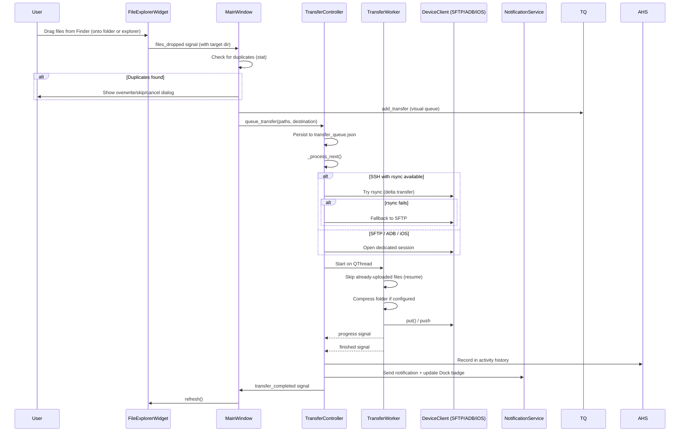
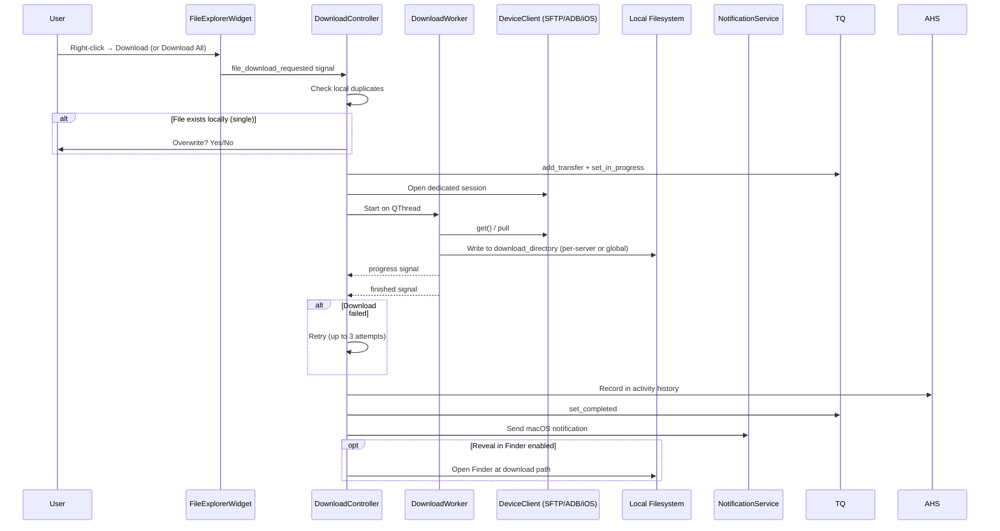
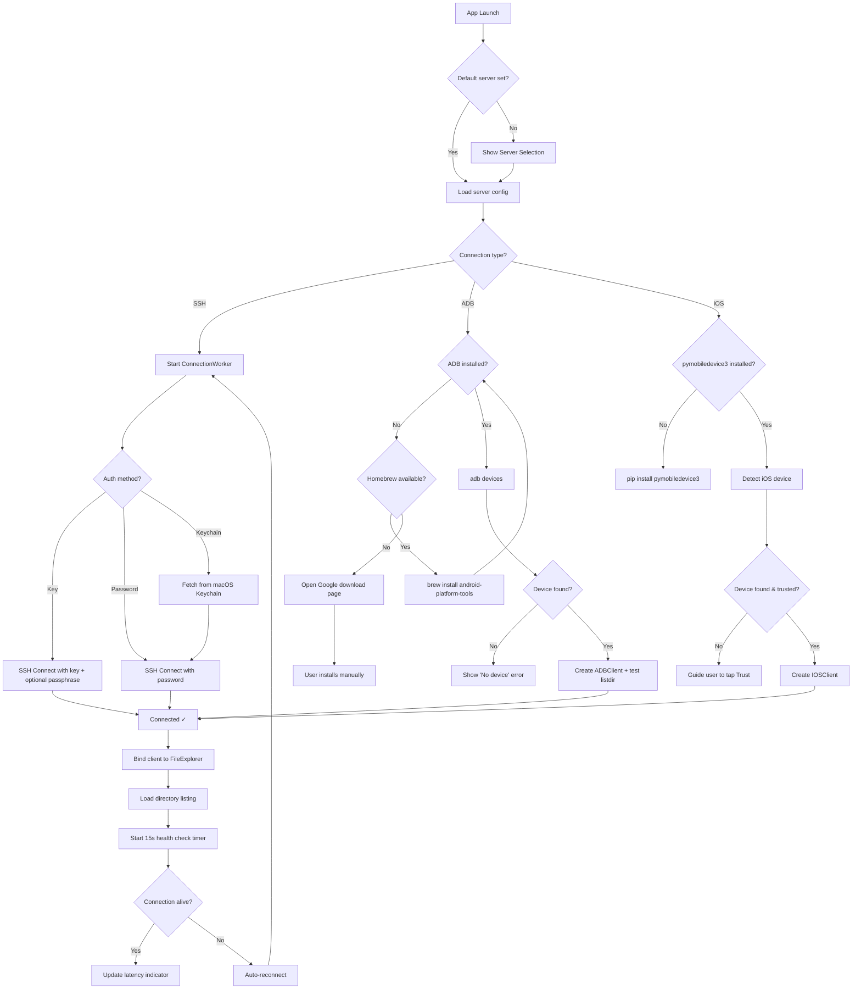
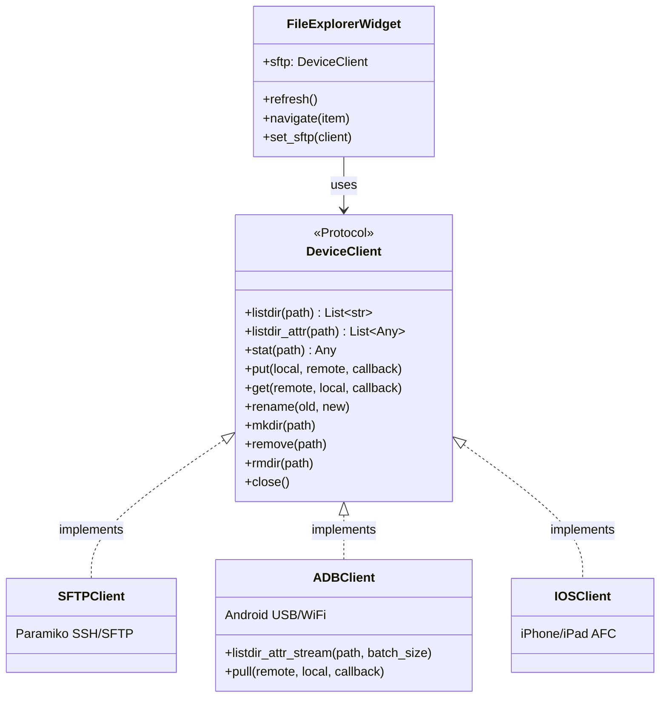
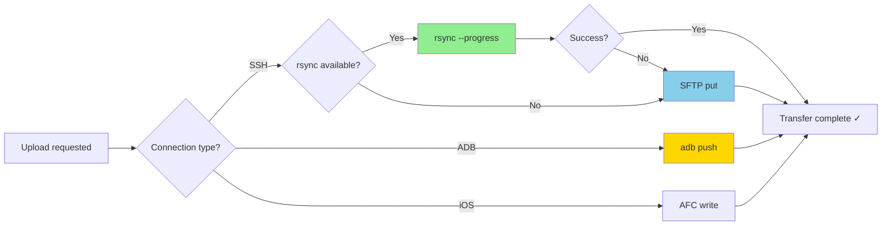
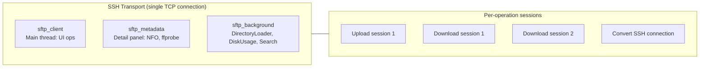

# System Diagram

> **Last updated:** July 2026 — Version 3.5.1

## High-Level Architecture

```mermaid
graph TB
    subgraph UI["UI Layer (PySide6)"]
        MW[MainWindow]
        FE[FileExplorerWidget]
        TQ[TransferQueueWidget]
        DP[DetailPanel]
        BB[BookmarksBar]
        VCM[VideoConvertManager]
        SS[SettingsWindow]
    end

    subgraph Dialogs["Dialogs"]
        SSD[ServerSelectionDialog]
        BRD[BatchRenameDialog]
        BMD[BatchMetadataDialog]
        CSD[ConvertSettingsDialog]
        FPD[FolderPickerDialog]
        MID[MediaInfoDialog]
        QFD[QuickFixDialog]
    end

    subgraph Controllers["Controller Layer"]
        MWC[MainWindowController]
        CC[ConnectionController]
        DC[DownloadController]
        FOC[FileOperationsController]
        TC[TransferController]
    end

    subgraph Workers["Background Threads (src/workers/)"]
        CW[ConnectionWorker]
        TW[TransferWorker]
        DW[DownloadWorker]
        DL[DirectoryLoader]
        SR[SearchWorker]
        DU[DiskUsageWorker]
    end

    subgraph Clients["Device Clients (src/clients/)"]
        DC_PROTO[DeviceClient Protocol]
        ADB[ADBClient]
        IOS[IOSClient]
        SFTP[Paramiko SFTPClient]
    end

    subgraph Services["Service Layer"]
        CM[ConnectionManagerService]
        RFS[RemoteFileService]
        FDS[FileDeletionService]
        AHS[ActivityHistoryService]
        NS[NotificationService]
        KS[KeychainService]
        RS[RsyncService]
        FF[FfmpegService]
        SI[SleepInhibitorService]
        MB[MenuBarService]
    end

    subgraph Platform["Platform Layer (src/platform/)"]
        PM[macOS — Keychain, osascript, caffeinate, Finder]
        PW[Windows — keyring, toast, SetThreadExecutionState, Explorer]
    end

    subgraph External["External Systems"]
        SSH[SSH/SFTP Server]
        Android[Android Device USB/WiFi]
        iPhone[iOS Device USB]
        FS[Local Filesystem]
    end

    subgraph Config["Configuration & Storage"]
        Settings[Settings Singleton]
        JSON["~/.FileSling/config.json"]
        History["~/.FileSling/transfer_history.json"]
        Queue["~/.FileSling/transfer_queue.json"]
        Errors["~/.FileSling/logs/errors.json"]
        Keychain["macOS Keychain"]
    end

    MW --> MWC
    MW --> FE
    MW --> TQ
    MW --> DP
    MW --> BB
    MWC --> CC
    MWC --> DC
    MWC --> FOC
    MWC --> TC
    MWC --> NS
    CC --> CW
    CC --> CM
    TC --> TW
    DC --> DW
    FE --> DL
    FE --> SR
    FE --> DU
    VCM --> FF

    DC_PROTO <|.. SFTP
    DC_PROTO <|.. ADB
    DC_PROTO <|.. IOS

    CM --> SSH
    ADB --> Android
    IOS --> iPhone
    FDS --> FS
    AHS --> History
    KS --> Keychain
    RS --> SSH
    Settings --> JSON
    TC --> Queue

    TW --> SFTP
    TW --> ADB
    TW --> IOS
    DW --> SFTP
    DW --> ADB
    DW --> IOS
    DL --> SFTP
    DL --> ADB
    DL --> IOS
```

## Upload Flow



## Download Flow



## Connection Flow



## Backend Abstraction



## Transfer Method Selection



## SFTP Channel Architecture


